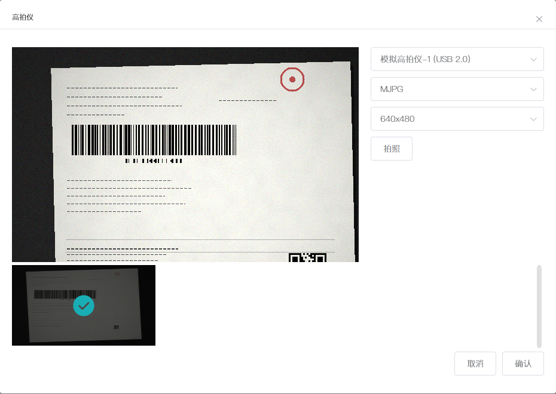

# high-speed-scanner

[](https://github.com/caixibei/high-speed-scanner/blob/main/LICENSE)
[](https://github.com/caixibei/high-speed-scanner/stargazers)
[](https://github.com/caixibei/high-speed-scanner/network/members)
[](https://github.com/caixibei/high-speed-scanner/issues)
[](https://nodejs.org)


高拍仪 WebSocket 模拟服务 — 在没有真实高拍仪硬件的电脑上，模拟高拍仪桌面端程序对外提供的 WebSocket 协议，供业务系统前端联调「高拍仪拍照」功能：设备发现、实时预览、拍照取图、关闭设备，全流程可用。

## 效果预览

前端接入后打开高拍仪弹窗的实际效果（左：定时推送的模拟预览帧与已拍缩略图；右：设备 / 视频格式 / 分辨率下拉与拍照按钮）：



## 工作原理

```text
业务系统前端（高拍仪弹窗组件）
        │  WebSocket（JSON 文本帧）
        ▼
ws://127.0.0.1:8082   ← 本服务（high-speed-scanner.js）
        │  按 VIDEO_FPS 定时推送预览帧
        ▼
waybill-renderer.js（合成模拟面单底照）→ png-encoder.js（纯 JS 编码 PNG）
```

- **协议**：JSON 文本帧，请求携带 `func`（指令名）与 `reqId`（请求 ID，响应原样返回）；响应携带 `result`（`0` 成功）。
- **预览流**：`GetCameraVideoBuff` 开启后，服务按 `VIDEO_FPS`（默认 5 fps）定时推送 PNG base64 帧。
- **画面**：程序合成的模拟面单底照（背景、纸张、面单内容、纸张纹理、传感器噪点、暗角 6 层），无任何真实摄像设备依赖。

## 快速开始

```bash
npm install
node high-speed-scanner.js
```

- 服务监听 `ws://127.0.0.1:8082`，控制台出现「高拍仪 WebSocket 模拟服务已启动」即启动成功。
- 前端打开高拍仪弹窗，设备下拉出现「模拟高拍仪-1 (USB 2.0)」即为接通。
- 环境要求：Node.js ≥ 10，无其他系统依赖。

## 前端接入

以下步骤整理自业务系统前端的实际接入方式，接入方按自身工程习惯落地即可。

### 1. 配置连接地址

前端工程通过环境变量读取服务地址（变量名由前端工程自行约定，下文以 `VUE_APP_HIGH_SPEED_SCANNER_URL` 为例），在前端工程根目录的 `.env.*` 中配置：

```bash
VUE_APP_HIGH_SPEED_SCANNER_URL=ws://127.0.0.1:8082
```

本地联调使用本机 `8082` 端口；修改 `.env` 后需重启前端服务才生效。

### 2. 使用业务系统已有的高拍仪弹窗组件（推荐）

若前端工程已提供高拍仪弹窗公共组件，直接复用即可，无需关心协议细节：

- 弹窗打开即自动建连并拉取设备列表；建连失败的典型提示为「未连接websocket服务器，请确保已运行服务端!」。
- 用户在弹窗内完成：选设备 / 格式 / 分辨率 → 拍照 → 勾选缩略图 → 确认。
- 已拍图片的回显、上传与确认结果由组件按其自身契约处理，与本服务无关。
- 若工程内暂无现成组件，可直接复制第 5 节的参考实现，对着本模拟服务立即联调。

### 3. 组件与服务的完整交互时序

| 步骤 | 前端发送 | 服务响应 / 推送 | 前端处理 |
|------|----------|------------------|----------|
| ① 建连 | `new WebSocket(VUE_APP_HIGH_SPEED_SCANNER_URL)` | — | `onopen` 后补发未发出的消息 |
| ② 取设备列表 | `{"func":"GetCameraInfo","reqId":"..."}` | `result:0` + `devInfo[]` | 渲染设备 / 格式 / 分辨率三个下拉 |
| ③ 打开设备 | `{"func":"OpenCamera","reqId":"...","devNum":0,"mediaNum":0,"resolutionNum":0,"fps":5}` | `result:0` | — |
| ④ 开启预览 | `{"func":"GetCameraVideoBuff","reqId":"...","devNum":0,"enable":"true"}` | 每 200ms 推一帧：`{func:"GetCameraVideoBuff",result:0,devNum,mime:"image/png",imgBase64Str,width:640,height:480}` | base64 显示到预览 `` |
| ⑤ 拍照 | `{"func":"CameraCaptureBase64","reqId":"..."}` | `{func:"CameraCaptureBase64",result:0,mime,imgBase64Str,width,height}` | 加入已拍缩略图列表 |
| ⑥ 切换设备/格式/分辨率 | 先 `{"func":"CloseCamera","reqId":"...","devNum":0}`，再重复 ③④ | `result:0` | 刷新下拉并重开预览 |
| ⑦ 关闭弹窗 | `{"func":"CloseCamera","reqId":"...","devNum":0}` | `result:0` | 服务端停止推帧 |

注：部分低代码生成的业务页面拍照发送的是 `{"func":"CameraCapture","reqId":"...","devNum":N,"mode":"base64"}` 变体；通用实现以 `CameraCaptureBase64` 为准，接入时以前端实际代码为准。

### 4. 不依赖组件的最小接入示例

```js
const ws = new WebSocket('ws://127.0.0.1:8082')
let reqId = Date.now()

ws.onopen = () => {
  ws.send(JSON.stringify({ func: 'GetCameraInfo', reqId: String(reqId) }))
}

ws.onmessage = (e) => {
  const msg = JSON.parse(e.data)
  if (msg.result !== 0 && msg.result !== 9) {   // 0/9 均按正常处理
    console.error(msg.func, msg.errorMsg)
    return
  }
  switch (msg.func) {
    case 'GetCameraInfo': {                     // ② 取第一台模拟设备并开预览
      const dev = msg.devInfo[0]
      ws.send(JSON.stringify({ func: 'OpenCamera', reqId: String(++reqId), devNum: dev.id, mediaNum: 0, resolutionNum: 0, fps: 5 }))
      ws.send(JSON.stringify({ func: 'GetCameraVideoBuff', reqId: String(++reqId), devNum: dev.id, enable: 'true' }))
      break
    }
    case 'GetCameraVideoBuff':                  // ④ 预览帧
      document.querySelector('#preview').src = 'data:' + msg.mime + ';base64,' + msg.imgBase64Str
      break
    case 'OpenCamera':                          // ③ 设备已打开，稍后即可拍照
      setTimeout(() => ws.send(JSON.stringify({ func: 'CameraCaptureBase64', reqId: String(++reqId) })), 1000)
      break
    case 'CameraCaptureBase64':                 // ⑤ 拍照结果
      console.log('拍照成功', msg.width + 'x' + msg.height, msg.mime)
      break
  }
}
```

### 5. 公共组件参考实现（Vue2 + Element UI，复制即用）

以下为整理自业务系统高拍仪弹窗公共组件的参考实现：已剥离内部请求封装与上传等私有依赖，协议交互与真实组件保持一致，复制到任意 Vue2 + Element UI 工程即可对本服务联调。确认时通过 `confirm` 事件把选中的 File 列表交给接入方，上传等业务动作由接入方自行补充。

```vue
<template>
  <el-dialog title="高拍仪" :visible.sync="visibleSync" width="930px" :close-on-click-modal="false" @opened="onOpened" @close="onClose">
    <div class="camera-content">
      <div class="camera-video-area">
        
      </div>
      <div class="camera-control-area">
        <el-select v-model="deviceNum" size="small" style="width: 100%; margin-bottom: 10px" @change="switchDevice">
          <el-option v-for="d in deviceOptions" :key="d.value" :label="d.label" :value="d.value" />
        </el-select>
        <el-select v-model="mediaNum" size="small" style="width: 100%; margin-bottom: 10px" @change="switchMedia">
          <el-option v-for="(m, i) in mediaOptions" :key="i" :label="m" :value="i" />
        </el-select>
        <el-select v-model="resolutionNum" size="small" style="width: 100%; margin-bottom: 10px" @change="switchMedia">
          <el-option v-for="(r, i) in resolutionOptions" :key="i" :label="r" :value="i" />
        </el-select>
        <el-button style="width: 100%" :disabled="!opened" @click="capture">拍照</el-button>
      </div>
    </div>
    <div class="camera-thumbs">
      <div v-for="img in imageList" :key="img.id" class="camera-thumb" :class="{ active: selectedIds.includes(img.id) }" @click="toggleSelect(img)">
        
        <i v-if="selectedIds.includes(img.id)" class="el-icon-success mask"></i>
        <i class="el-icon-delete del" @click.stop="removeImg(img)"></i>
      </div>
    </div>
    <div slot="footer" class="camera-footer">
      <el-button @click="visibleSync = false">取消</el-button>
      <el-button type="primary" @click="onConfirm">确认</el-button>
    </div>
  </el-dialog>
</template>

<script>
export default {
  name: 'HighSpeedCameraDialog',
  props: {
    visible: { type: Boolean, default: false },
    limit: { type: Number, default: 1 },                               // 最多可选张数
    wsUrl: { type: String, default: 'ws://127.0.0.1:8082' }            // 模拟服务地址，可换成本地组件
  },
  data() {
    return {
      ws: null,
      connected: false,      // WebSocket 是否已连接
      opened: false,         // 是否已打开设备并开始预览
      reqId: 0,
      devInfoList: [],       // GetCameraInfo 返回的设备列表
      deviceNum: -1,         // 下拉选中的设备
      openedDevNum: -1,      // 当前已打开的设备（切换下拉时先关闭它）
      mediaNum: 0,
      resolutionNum: 0,
      imageList: [],         // 已拍图片
      selectedIds: []
    }
  },
  computed: {
    visibleSync: {
      get() { return this.visible },
      set(val) { this.$emit('update:visible', val) }
    },
    deviceOptions() {
      return this.devInfoList.map(d => ({ label: d.devName, value: d.id }))
    },
    mediaOptions() {
      const dev = this.devInfoList.find(d => d.id === this.deviceNum)
      return dev ? dev.mediaTypes.map(m => m.mediaType) : []
    },
    resolutionOptions() {
      const dev = this.devInfoList.find(d => d.id === this.deviceNum)
      const media = dev && dev.mediaTypes[this.mediaNum]
      return media ? media.resolutions : []
    }
  },
  beforeDestroy() {
    if (this.ws) { this.ws.close(); this.ws = null }
  },
  methods: {
    // ============ 连接 ============
    onOpened() {
      // 弹窗打开即建连，连上后立刻拉取设备列表
      this.connect(() => this.send({ func: 'GetCameraInfo' }))
    },
    connect(firstCommand) {
      this.ws = new WebSocket(this.wsUrl)
      this.ws.onopen = () => {
        this.connected = true
        if (firstCommand) firstCommand()
      }
      this.ws.onmessage = e => this.onMessage(JSON.parse(e.data))
      this.ws.onerror = () => this.$message.error('未连接websocket服务器，请确保已运行服务端!')
      this.ws.onclose = () => { this.connected = false }
    },
    send(command) {
      const json = { reqId: String(++this.reqId), ...command }
      if (this.connected) {
        this.ws.send(JSON.stringify(json))
      } else {
        // 未连接时先建连，连上后补发（与真实组件行为一致）
        this.connect(() => this.ws.send(JSON.stringify(json)))
      }
    },
    // ============ 消息处理 ============
    onMessage(msg) {
      if (msg.result !== 0 && msg.result !== 9) return   // 0/9 均按正常处理
      switch (msg.func) {
        case 'GetCameraInfo': return this.displayDevInfo(msg.devInfo)
        case 'GetCameraVideoBuff': return this.displayVideo(msg)
        case 'CameraCaptureBase64': return this.addImg(msg)
      }
    },
    // ============ 设备与预览 ============
    displayDevInfo(devInfo) {
      if (!devInfo || !devInfo.length) { this.$message.warning('高拍仪设备信息为空'); return }
      this.devInfoList = devInfo
      this.deviceNum = devInfo[0].id
      this.openCamera()
    },
    openCamera() {
      this.openedDevNum = this.deviceNum
      this.send({ func: 'OpenCamera', devNum: this.deviceNum, mediaNum: this.mediaNum, resolutionNum: this.resolutionNum, fps: 5 })
      this.send({ func: 'GetCameraVideoBuff', devNum: this.deviceNum, enable: 'true' })
      this.opened = true
    },
    switchDevice() {
      if (this.opened) this.send({ func: 'CloseCamera', devNum: this.openedDevNum })
      this.mediaNum = 0
      this.resolutionNum = 0
      this.openCamera()
    },
    switchMedia() {
      if (this.opened) this.send({ func: 'CloseCamera', devNum: this.openedDevNum })
      this.openCamera()
    },
    displayVideo(msg) {
      const preview = this.$refs.preview
      if (preview) preview.src = 'data:' + msg.mime + ';base64,' + msg.imgBase64Str
    },
    // ============ 拍照与选图 ============
    capture() {
      this.send({ func: 'CameraCaptureBase64' })
    },
    addImg(msg) {
      const id = 'img-' + msg.reqId
      this.imageList.push({ id, mime: msg.mime, base64: msg.imgBase64Str, url: 'data:' + msg.mime + ';base64,' + msg.imgBase64Str })
      if (this.selectedIds.length < this.limit) this.selectedIds.push(id)
    },
    toggleSelect(img) {
      const index = this.selectedIds.indexOf(img.id)
      if (index > -1) {
        this.selectedIds.splice(index, 1)
      } else {
        if (this.selectedIds.length >= this.limit) { this.$message.warning('最多选择' + this.limit + '张图片'); return }
        this.selectedIds.push(img.id)
      }
    },
    removeImg(img) {
      const index = this.selectedIds.indexOf(img.id)
      if (index > -1) this.selectedIds.splice(index, 1)
      this.imageList = this.imageList.filter(e => e.id !== img.id)
    },
    // ============ 确认与关闭 ============
    onConfirm() {
      if (!this.selectedIds.length) { this.$message.warning('请至少选择一张图片'); return }
      const files = this.imageList
        .filter(img => this.selectedIds.includes(img.id))
        .map(img => this.base64ToFile(img.base64, img.mime))
      this.$emit('confirm', files)   // 上传等业务动作由接入方在 confirm 里自行处理
      this.visibleSync = false
    },
    base64ToFile(base64, mime) {
      const bin = atob(base64)
      const u8arr = new Uint8Array(bin.length)
      for (let i = 0; i < bin.length; i++) u8arr[i] = bin.charCodeAt(i)
      return new File([u8arr], '高拍仪图片_' + Date.now() + '.' + mime.split('/')[1], { type: mime })
    },
    onClose() {
      if (this.opened) this.send({ func: 'CloseCamera', devNum: this.openedDevNum })
      if (this.ws) { this.ws.close(); this.ws = null }
      this.connected = false
      this.opened = false
      this.imageList = []
      this.selectedIds = []
    }
  }
}
</script>

<style scoped>
.camera-content { display: flex; }
.camera-video-area { flex: 1; height: 360px; background: #000; }
.camera-video-area img { width: 100%; height: 100%; object-fit: contain; }
.camera-control-area { width: 220px; margin-left: 16px; }
.camera-thumbs { margin-top: 12px; max-height: 150px; overflow: auto; }
.camera-thumb { position: relative; display: inline-block; width: 120px; height: 90px; margin: 0 8px 8px 0; border: 2px solid transparent; cursor: pointer; }
.camera-thumb.active { border-color: #4e90f6; }
.camera-thumb img { width: 100%; height: 100%; object-fit: cover; }
.camera-thumb .mask { position: absolute; top: 4px; left: 4px; color: #4e90f6; font-size: 20px; }
.camera-thumb .del { position: absolute; top: 4px; right: 4px; color: #fff; font-size: 16px; }
.camera-footer { text-align: right; }
</style>
```

接入方使用方式：注册组件后，用一个按钮控制 `visible`，监听 `confirm` 事件拿到 File 列表后接自己的上传接口即可。

## 协议指令一览

| func | 方向 | 关键字段 | 说明 |
|------|------|----------|------|
| `GetCameraInfo` | 请求 → 响应 | 响应含 `devInfo[]`：`{id, devName, mediaTypes:[{mediaType, resolutions[]}]}` | 返回模拟设备列表 |
| `OpenCamera` | 请求 → 响应 | `devNum`、`mediaNum`、`resolutionNum`、`fps` | 打开指定设备 |
| `SetCameraInfo` | 请求 → 响应 | `mediaNum`、`resolutionNum` | 切换媒体格式 / 分辨率 |
| `SetCameraImageInfo` | 请求 → 响应 | `cropType`、`imageType` | 设置图像算法参数 |
| `GetCameraVideoBuff` | 请求；响应为定时推送 | 请求 `devNum`、`enable:"true"/"false"`；帧含 `mime`、`imgBase64Str`、`width`、`height` | 开启 / 停止预览流推送 |
| `CameraCaptureBase64` | 请求 → 响应 | 响应含 `mime`、`imgBase64Str`、`width`、`height` | 拍照，返回单帧 base64 |
| `CloseCamera` | 请求 → 响应 | `devNum` | 关闭设备并停止推帧 |
| `GetOcrSupportInfo` | 请求 → 响应 | 响应含 `languages[]` | 返回支持的 OCR 语言列表 |
| `ExternalButton` | 请求 → 响应 | — | 外部按钮占位指令，直接返回成功 |

约定：所有消息均为 JSON 文本帧；`reqId` 原样回传；`result` 为 `0` 表示成功（前端把非 `0` 且非 `9` 视为错误并读取 `errorMsg`）。

## 模拟设备清单

| id | 设备名 | 媒体格式 | 可选分辨率 |
|----|--------|----------|------------|
| 0 | 模拟高拍仪-1 (USB 2.0) | MJPG / YUY2 | 640x480、1280x720、1920x1080 |
| 1 | 模拟高拍仪-2 (USB 3.0) | MJPG | 640x480、2592x1944 |

## 可配置参数

编辑 `high-speed-scanner.js` 顶部常量：

| 常量 | 默认值 | 说明 |
|------|--------|------|
| `PORT` | `8082` | WebSocket 监听端口；修改后需同步前端服务地址配置 |
| `VIDEO_FPS` | `5` | 预览帧率 |
| `VIDEO_WIDTH` | `640` | 预览帧宽度 |
| `VIDEO_HEIGHT` | `480` | 预览帧高度 |

## 常见问题

- **弹窗提示「未连接websocket服务器，请确保已运行服务端!」**：本服务未启动、端口不一致，或修改 `.env` 后前端未重启。
- **设备下拉提示「高拍仪设备信息为空」**：连接成功但设备列表为空；模拟服务固定返回 2 台设备，出现此提示说明连到了其他服务。
- **预览黑屏 / 不动**：确认已发送 `GetCameraVideoBuff` 且 `enable:"true"`；刷新页面重新建连。
- **端口被占用**：修改 `PORT` 并同步前端服务地址配置。

## 与真实高拍仪的差异

- 设备列表固定为 2 台模拟设备，不支持设备热插拔；部分前端组件监听的 `Notify`/`OnDeviceChanged` 设备变更推送在本服务上不会出现（对应分支不触发属预期行为）。
- 预览与拍照画面均为程序合成的模拟面单底照，仅分辨率与噪点强度不同，非真实拍摄内容。
- OCR / 条码识别相关指令仅返回支持项列表，不做真实识别。

## 项目结构

```text
├── high-speed-scanner.js   # WebSocket 服务、协议路由、会话管理
├── waybill-renderer.js     # 模拟面单底照渲染管线（6 层合成）
├── png-encoder.js          # PNG 编码器（纯 JS）
├── docs/preview-dialog.png # 前端接入效果预览图
└── package.json
```
